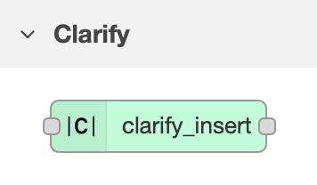

# node-red-contrib-clarify

Node-Red Nodes for adding data to Clarify.
Learn more about Clarify at: https://www.clarify.io

Available nodes are:

- clarify_insert: A node to create signals, update meta-data and insert data into Clarify.
- clarify_api: A `configuration node` to establish connection to Clarify.

This node will create a json-database to keep track of the signals and meta data written to Clarify.

This database will be stored in the default userDir. By default, this directory is a directory called `.node-red` under
the user's home directory, but can be overriden in the `node-red-settings.js`.

If you are moving your node-red instance or creating backups, be sure to include the folder `clarify-db/`.

## Examples

You can find an example flow that shows how to use the insert node in `examples/random-data-example.json`. Please review the `Generate Data` function. Remember to update the `clarify_api` configuration node with credentials downloaded from your integration in the Clarify Admin Panel.

Any questions? Send us an email on support@clarify.io
